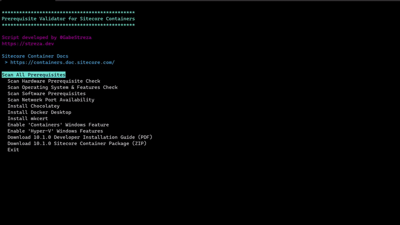

# Sitecore Containers Prerequisites

Checks the machine for Sitecore Container compatibility.

## tl;dr Usage
You can run the script (in an admin-elevated PowerShell session) like this: 
`Start-BitsTransfer -Source "https://raw.githubusercontent.com/strezag/sitecore-containers-prerequisites/main/sitecore-containers-prerequisites.ps1"; .\sitecore-containers-prerequisites.ps1`

## Features

Quickly verify Sitecore Container:
- Hardware requirements (CPU, RAM, DISK STORAGE and TYPES)
- Operating system compatibility (OS Build Version, Hyper-V/Containers Feature Check, IIS Running State)
- Software requirements (Docker Desktop, Docker engine OS type Linux vs Windows Containers, Sitecore Docker Tools, Sitecore License persistence in user environment variable)
- Network Port Check (443, 8079, 8984, 14330)

Download and install software:
- Chocolatey
- Docker Desktop
- mkcert

Enable required Windows Features
- Containers
- Hyper-V

Download latest 10.1.0 
- Container Package ZIP
- Local Development Installation Guide PDF

Miscellaneous
- Remove Sitecore license persisted in user environment variable (can be problematic as it overrides session variables in modern Docker solutions)
- Unattended and Quiet options with ability to select test type via parameter

## Full Scan Demo

## Demo of Docker Container Type Identification

